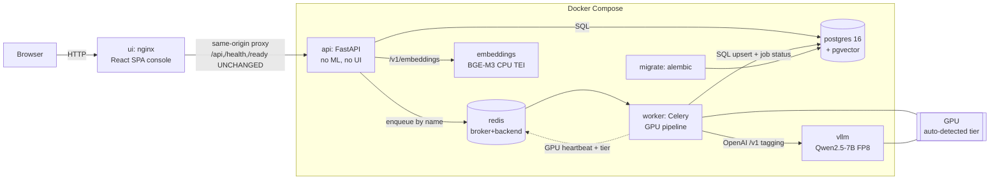

# Architecture

Katbook VIP turns an educational video into per-segment structured tags
(`topic, subject, grade_level, difficulty, content_type, tags, subtopics,
summary, confidence` + a 1024-d embedding), stored in Postgres and queryable by
meaning or keyword. It handles **narrated and silent** videos in **any language**.

The POC was a single-notebook monolith on a free Kaggle T4. Production is an
**API-first, Dockerized, service** architecture on a dedicated RTX 5090 — the
pipeline *logic* is preserved; the *packaging, serving, storage, and models* were
upgraded.

## Service architecture



The **ui** service is the product's default console (React SPA served by nginx),
but the backend is still API-first: nginx reverse-proxies `/api`,`/health`,`/ready`
to the `api` service **unchanged** (same-origin), so any external frontend can
replace the console via the same documented API. The `api` process loads **zero**
UI code and no ML model.

- **api** — the only thing the frontend talks to. Versioned REST (`/api/v1`),
  Pydantic v2 models, consistent error envelope, request-ID middleware, API-key
  auth, CORS, OpenAPI at `/docs`. **Loads no ML model** and does no GPU work; it
  registers videos (with the SHA-256 dedup pre-check), enqueues jobs, reads status
  and search results.
- **worker** — Celery consumer on the `gpu` queue, concurrency 1 per GPU. Imports
  `pipeline` and runs `process_one_video` per task, reporting each stage to the
  job row. Transient failures retry with backoff; poison inputs fail fast. Adding
  a second 5090 = another worker with `CUDA_VISIBLE_DEVICES=1`.
- **vllm** — OpenAI-compatible server for the tagging LLM (Qwen2.5-7B-Instruct,
  FP8 on Blackwell). Swapping to 14B is a `VLLM_MODEL` change, not code.
- **embeddings** — CPU BGE-M3 (TEI), used only to embed **search queries** so the
  API stays ML-free; segment embeddings are produced by the worker with the same
  model (shared vector space).
- **postgres + pgvector** — the single source of truth (see `DATABASE.md`).
- **redis** — broker, result backend, and the worker GPU heartbeat.
- **migrate** — one-shot Alembic `upgrade head`, gated before api/worker start.

## The two paths: VOICE vs SILENT (unchanged from the POC)

The first real decision is a route from cheap signals:

```
detect_speech (ffmpeg RMS, dB) ─┐
transcribe (Whisper) → speech_sec┴─► router.decide()
        no speech OR speech_sec < MIN_SPEECH_SEC  → SILENT path
        otherwise                                  → VOICE path
```

- **VOICE** — the **transcript is ground truth**; frames are light hints; the LLM
  prompt trusts spoken words and treats on-screen text/objects as weak evidence.
- **SILENT** — the **frames carry all meaning**; sample more frames, OCR **every**
  frame, force BLIP-2 captions, and the LLM prompt is visual-primary with **lower
  confidence**.

## One model in VRAM at a time (preserved, relaxed on 32 GB)

Every heavy model loads inside `utils.managed_model()` — load → yield → free →
empty CUDA cache, even on error — so VRAM returns to baseline between stages. On
the 32 GB 5090 the **production** profile sets `RESIDENT_VISUAL_STACK=1`, keeping
CLIP + YOLO + OCR resident **together** for the visual stage (BLIP-2 still gets its
own context). The shared small models (BGE-M3 embedder + spaCy) load once per
worker process; the tagging LLM is served out-of-process by vLLM.

## Speed wins (unchanged)

Adaptive frame sampling (uniform anchors + scene cuts, capped), **gated YOLO**
(real-world scenes only — kills animation hallucinations *and* saves time), **gated
OCR** (text-likely scenes, or all frames when silent), **batched CLIP**, and
**fewer/larger segments → fewer LLM calls** (`MAX_SEGMENTS`).

## Segmentation & the consistency pass (unchanged)

- **Voiced**: embed transcript windows, cut at cosine-similarity drops (knee
  detection), merge by duration, split over `MAX_SEGMENT_SEC`, guarantee full
  `[0, duration]` coverage.
- **Silent**: group consecutive same-scene frames into time blocks.
- A **consistency pass** unifies subject/grade across a video's segments (majority
  vote, ties by confidence), keeping the raw label under `*_raw`.

## What changed vs the POC (and why)

| Area | POC | Production |
|---|---|---|
| Delivery | single Kaggle notebook | API + worker + vLLM + redis + postgres (compose) |
| Config | hand-rolled `CONFIG` dict | `pydantic-settings` `Settings` (same env names) |
| Tagging LLM | Qwen 7B 4-bit **in-process** (bitsandbytes) | Qwen 7B **FP8 via vLLM** (HTTP); bitsandbytes out of the prod path |
| Whisper / CLIP / YOLO | medium / ViT-B-32 / YOLOv8n | large-v3 FP16 / ViT-L-14 / YOLO11x |
| Embeddings | MiniLM 384-d | **BGE-M3 1024-d** (Tamil/Hindi/English) |
| DB | Neon free tier, inline `CREATE TABLE` | Postgres 16 + pgvector, **Alembic** migrations, HNSW + FTS |
| Segment storage | `llm` JSONB blob | **typed columns** + `extra`/`ocr` (lossless) |
| Logging | `print` | structured JSON (request_id / video_id / stage) |
| Decode | CPU ffmpeg | **NVDEC** (`-hwaccel cuda`) with CPU fallback |
| Runtime | T4 (sm_75) | **RTX 5090 / Blackwell sm_120**, cu128 torch |

## GPU tiers (auto-detected)

The worker detects its GPU at startup (`pipeline/gpu_profile.py`) from the device
name + VRAM + compute capability and adapts the **worker-loaded** model knobs.
`GPU_PROFILE` env forces a tier. Precedence, layered into the existing settings
system: **explicit env > GPU_PROFILE tier > profile defaults**.

| Tier | Detected when | Whisper | CLIP | YOLO | BLIP-2 | OCR | Resident stack |
|---|---|---|---|---|---|---|---|
| `cpu` | no CUDA | tiny/int8 | ViT-B/32 | off | off | en | no |
| `t4_16gb` | VRAM < 20 GB | medium | ViT-B/32 | yolov8n | opt-2.7b | en | no |
| `rtx_high` | 20–30 GB (4080/4090) | large-v3 | ViT-L/14 | yolo11l | opt-2.7b | en+ta+hi | yes |
| `rtx5090` | ≥30 GB / sm_120 / "5090" | large-v3 | ViT-L/14 | yolo11x | opt-2.7b | en+ta+hi | yes |
| `datacenter` | A100/H100/H200/B200 | large-v3 | ViT-L/14 | yolo11x | opt-6.7b | en+ta+hi | yes |

**Invariant across every tier:** the embedder is **BGE-M3 (1024-d)** because the
DB column is `vector(1024)` — the worker asserts `EMBED_DIM == 1024` at startup and
fails fast otherwise. vLLM tagging stays a compose-level service (the tier never
toggles it). The resolved tier is recorded in each video's `runtime` metadata and
published on the worker heartbeat → shown on `/ready`, the console's System page,
and the header GpuTierChip.

## Preserved safety rules (do not regress)

1. **Only byte-identical files are deduplicated** — SHA-256 match → stored as a
   reference to its canonical, never reprocessed. Same-topic/different-content
   videos are **never** auto-merged.
2. **No hard deletes** — `DELETE` is a soft status flag; content and segments stay.
3. **Idempotency** — `video_id = uuid5(source_path)`; re-runs UPSERT, never
   duplicate rows.
4. **Export shape** — the per-video JSON contract is unchanged and reconstructable
   from the DB.

## Restartability

The expensive transcript is checkpointed per video; the batch skips videos already
`done`; Celery `acks_late` re-queues a task if the worker dies. A killed run
resumes cheaply.
